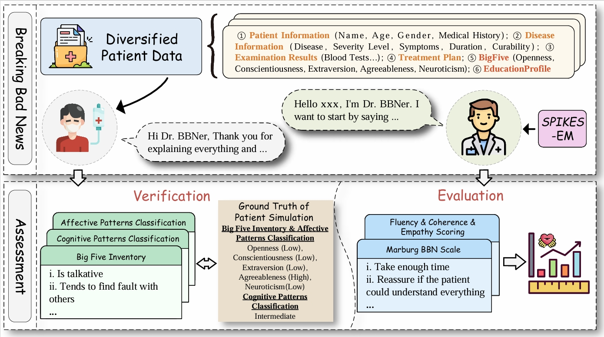
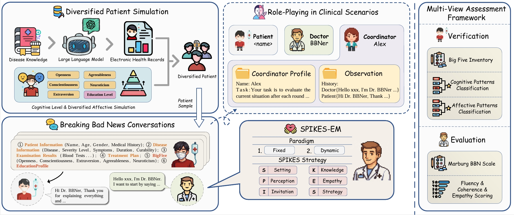
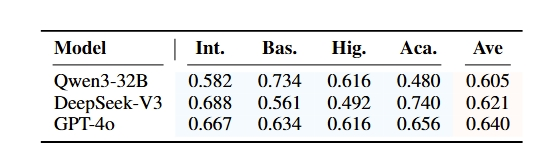
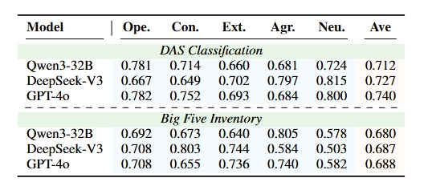
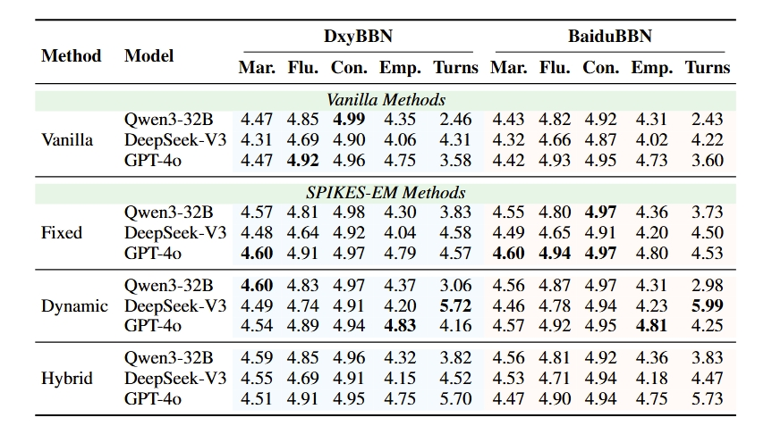

<div align="center">
  
</div>

<h2 align="center">😄 Talk with Empathetic Clinical Agents: BREAKING BAD NEWS Conversations via Diversified Patient Simulation</h2>
</div>
<div style="text-align: center;">
  
  
  
</div>

:fire:This work explores the empathetic communication capabilities of LLMs by proposing the **SPIKES-EM** framework, which empowers doctor agents to conduct Strategic and Empathetic **Breaking Bad News** conversations with diverse simulated patients.

>"To cure sometimes, to relieve often, to comfort always."<br>
>— Edward Livingston Trudeau

### Brief Introduction

Empathetic communication is a critical yet underexplored aspect of AI in healthcare. Among the most challenging scenarios is Breaking Bad News (BBN) , the process of delivering distressing medical information to critically ill patients with empathy, clarity, and professionalism. While large language models (LLMs) have shown strong performance in tasks such as diagnosis and factual dialogue, they still lack robust mechanisms to handle emotionally sensitive, high-stakes interactions like BBN. 

- **❗ High Emotional Complexity: **: Unlike mental health dialogue systems, which often deal with lower-risk scenarios such as academic stress or interpersonal issues, Breaking Bad News (BBN) involves *highly vulnerable patients and intense emotional dynamics*.
- **⚖️ Asymmetry of Roles**: The physician holds extensive medical expertise and decision-making authority, while the critically ill patient, who *lacks full understanding of their condition*, remains in a passive and emotionally extremely **vulnerable position**.
- **⏱️ Time and Resource Constraints**: In real clinical practice, doctors often lack the bandwidth to deliver bad news with consistent empathy and care.

<div align="center">
    
    <p class="image-caption">Figure 1: Procedure of BBN conversations simulation. In this setting, the doctor agent is guided by the SPIKES-EM to interact with diversified patient agents. The process supports the assessment of both the quality of patient-side role-playing and the empathetic behavior of the doctor agent.</p>
</div>

🌟In this project, we take a major step toward addressing these challenges by proposing a novel framework based on LLM agents. Specifically: (1) We build a diversified patient simulation dataset covering 151 critical illnesses, each patient enriched with cognitive traits📐 (e.g., education level) and affective profiles💗 (based on Big Five personality theory). (2) We introduce the SPIKES Empathy Module (SPIKES-EM) 🤝 , a strategic communication guide inspired by the SPIKES protocol, to train doctor agents to break bad news empathetically. (3) We design a multi-view assessment framework 📊 that evaluates both the realism of patient responses and the empathetic competence of the doctor agents using automatic and human-aligned metrics.

### Framework
<div align="center">
    
    <p class="image-caption">Figure 2: Overview of our proposed framework for BBN conversations simulation and multi-view assessment.</p>
</div>


## Run

**Preparation**

  ```shell
  pip3 install -r requirements.txt
  ```
* Set your openai API_KEY in `BBN_simulation.sh`
* Set your openai API_KEY in `doc_pat_int.py`

**Run BBN Simulation**

```shell
sh BBN_simulation.sh 
```

**Run doc_pat_int**

If you just want to have a try, you can try the doc_pat_int script on your PC.

```shell
python3 doc_pat_int.py
```
## Main Results

### Cognitive & Affective Classification

<div align="center">
    
    <p class="image-caption">Table 1: F1 Scores for Cognitive Level Simulation. The gold label corresponds to the assigned education level in the simulated patient profiles.</p>
</div>

<div align="center">
    
    <p class="image-caption">Table 1: F1 Scores for Diversified Affective Simulation based on the Big Five Inventory. The gold label corresponds to the assigned affective traits in the simulated patient profiles.</p>
</div>

---

### Main

<div align="center">
    
    <p class="image-caption">Table 2: Automatic evaluation results for the doctor agent in BBN conversations simulation.</p>
</div>


